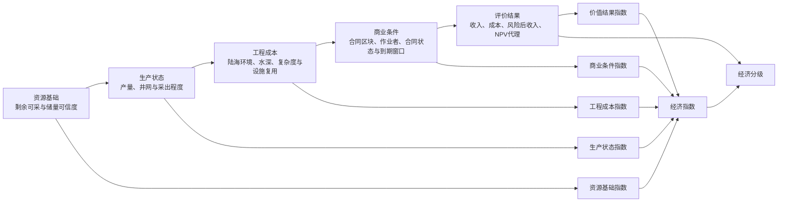

# 非洲油气田经济评价流程与算法设计

更新时间：2026-09-07

## 1. 评价对象和结论

当前“经济评价”评价的是非洲油气田，不是盆地、合同区块或单井。最终结论用于判断某个油气田在当前价格、成本、风险和合同条件假设下，是否值得进入下一步经济参数复核。

最终输出包括：

| 输出 | 含义 |
|---|---|
| `economicIndex` | 油气田经济吸引力综合指数，0-100，越高表示越值得优先复核 |
| `npvProxyMM` | 净现值代理，单位 MMUSD，用于表达价值空间 |
| `grade` | 经济评价分级：优先复核、进入参数复核、观察、暂缓 |
| `scores` | 资源、生产、工程、商业、价值五类分项指数 |

需要注意：当前模型是原型级经济评价代理模型，不是正式投资决策 NPV 模型。正式模型仍需补充权益、税制、合同模式、产量曲线、CAPEX/OPEX 明细、国家风险和设施条件。

## 2. 总体计算逻辑

这套经济评价流程可以理解为一条从“地下资源”到“经济结论”的判断链。每个阶段不是独立给油气田做一个静态排名，而是负责回答经济评价中的一个关键问题，并把本阶段结果转成一个 0-100 的阶段指数，最后共同进入总经济指数。

| 阶段 | 需要回答的问题 | 阶段作用 | 阶段输出 | 如何进入最终结果 |
|---|---|---|---|---|
| 资源基础 | 这个油气田还有多少可采资源？资源规模是否值得继续评价？ | 确认经济评价的资源前提，避免对资源规模过小或储量可信度过低的对象继续放大计算 | 剩余可采当量、总可采当量、采收率、储量可信度、资源基础指数 | 资源基础指数按 20% 权重进入经济指数；剩余可采当量继续参与收入和开发投资计算 |
| 生产状态 | 这些资源能不能形成产量和现金流？ | 判断油气田是否已有生产、井网和活动生产能力，降低纯资源数字带来的不确定性 | 年产量代理、生产井比例、活动生产井比例、采出程度、生产状态指数 | 生产状态指数按 18% 权重进入经济指数；年产量代理继续参与年现金流计算 |
| 工程成本 | 把剩余资源开发出来大概要花多少钱？ | 根据陆上/海上、水深、储层复杂度和设施复用情况估算单位开发成本和开发投资 | 单位开发成本、开发投资代理、工程成本指数 | 工程成本指数按 18% 权重进入经济指数；开发投资代理直接从 NPV 代理中扣减 |
| 商业条件 | 合同、作业者和到期窗口是否支持项目推进？ | 将合同区块状态、作业者完整性和合同窗口转成商业修正，反映项目可进入性 | 匹配合同区块、商业条件系数、商业条件指数 | 商业条件指数按 16% 权重进入经济指数；商业条件系数用于折减风险后收入 |
| 评价结果 | 在当前参数下，这个油气田经济吸引力如何？ | 汇总收入、现金流、成本和风险，形成价值结果和最终分级 | 总收入代理、风险后收入、NPV 代理、价值结果指数、经济指数、经济分级 | 价值结果指数按 28% 权重进入经济指数；NPV 代理和经济指数共同决定最终分级 |

总的计算关系如下：

```text
资源基础阶段输出：资源基础指数、剩余可采当量
生产状态阶段输出：生产状态指数、年产量代理
工程成本阶段输出：工程成本指数、开发投资代理
商业条件阶段输出：商业条件指数、商业条件系数

评价结果阶段：
  使用剩余可采当量计算总收入代理
  使用年产量代理计算年现金流现值
  使用商业条件系数和储量可信度折减收入
  使用开发投资代理扣减成本
  得到 NPV 代理和价值结果指数

最终经济指数 =
  资源基础指数 × 0.20
  + 生产状态指数 × 0.18
  + 工程成本指数 × 0.18
  + 商业条件指数 × 0.16
  + 价值结果指数 × 0.28
```

最终输出的解释：

| 输出 | 解释 |
|---|---|
| 经济指数 | 综合排序指标，用来比较不同油气田的经济吸引力。指数越高，说明资源、生产、成本、商业和价值结果综合表现越好 |
| NPV 代理 | 金额型代理指标，用来表达当前假设下的价值空间。它用于筛选和比较，但不是正式投资决策 NPV |
| 经济分级 | 面向业务使用的结论标签，把油气田划分为优先复核、进入参数复核、观察、暂缓 |
| 分项指数 | 解释经济指数来自哪里，帮助判断油气田是资源好、生产好、成本低、商业条件好，还是价值结果好 |

## 3. 流程关系



整体逻辑是：先确认资源规模，再判断能否形成产量，再估算开发成本，再修正商业条件，最后把收入、成本和风险汇总为经济结果。

## 4. 各阶段输入数据与参数总览

下表是当前后端计算实际读取的主要字段和可由用户调整的参数。这里的“油气田数据 CSV”指已接入的油气田属性表；“合同区块 GIS 服务”指已发布的合同区块空间服务；“前序阶段输出”是本流程前面步骤计算出的中间结果，并非静态文件。

| 阶段 | 已接入数据来源 | 实际参与计算的主要字段 | 本阶段可输入参数 |
|---|---|---|---|
| 资源基础 | 油气田数据 CSV | `Oil Remaining Pp Mmbbl`、`Gas Remaining Pp Mmscf`、`Cond Remaining Pp Mmbbl`、`Tot Remaining Pp Mmboe`、`Tot Recoverable Pp Mmboe`、`Tot In Place Pp Mmboe`、`Cumul Tot Prod Mmboe`、`Oil/Gas/Cond Reserve Data Srce`、`Numb Reservoirs` | 无。直接由已接入资源字段计算。 |
| 生产状态 | 油气田数据 CSV | `Prod Status`、`Latest Annual Oil Prod Bbl`、`Latest Annual Gas Prod Tscf`、`Latest Annual Cond Prod Bbl`、`Cumul Tot Prod Mmboe`、`Tot Recoverable Pp Mmboe`、`Numb Wells`、`Numb Producers`、`Numb Act Producers` | `evaluationYears`（评价年限）。当缺少实际年产量时，用于计算年产量代理的时间尺度。 |
| 工程成本 | 油气田数据 CSV | `Ons Offshore`、`Terrain`、`Water Depth Max Val Meter`、`Numb Reservoirs`、`Field Sqkm`、`Prod Status`、`Numb Producers`、`Numb Act Producers`、`Numb Shows Wells`、`Numb Dry Wells`；并使用资源阶段的剩余可采当量 | `onshoreCostUsdPerBoe`、`shelfCostUsdPerBoe`、`deepwaterCostUsdPerBoe`、`facilityReuseCreditPct`。 |
| 商业条件 | 油气田数据 CSV + 合同区块 GIS 服务 | 油气田 CSV：`Cur Contract Block Names`、`Cur Operator Names`、`Cur Group Names`、`Basin Name`、`Country Names`、`Numb Wells`、`Numb Producers`；合同区块服务：`BLOCK_NAME`、`CONTRACT`、`BAS_NAMES`、`OPERATOR`、`CON_STATUS`、`BLK_STATUS`、`EXP_DT_YR` | 无。合同状态、到期窗口和作业者情况直接参与计算。 |
| 评价结果 | 前序阶段输出 + 油气田数据 CSV | 前序输出：剩余可采当量、储量可信度、年产量代理、开发投资代理、商业条件系数；油气田 CSV：`Oil Remaining Pp Mmbbl`、`Gas Remaining Pp Mmscf`、`Cond Remaining Pp Mmbbl`、`Numb Wells`、`Ons Offshore` | `oilPriceUsdPerBbl`、`gasPriceUsdPerMcf`、`boeRevenueUsdPerBoe`、`opexUsdPerBoe`、`discountRatePct`、`evaluationYears`、`geologicalRiskPct`、`fiscalTakePct`。 |

所有阶段还可使用国家、盆地、生产状态、油气类型、关键字、最小剩余可采和最大水深作为评价对象筛选条件。筛选条件只决定“对哪些油气田计算”，不会替代公式中的业务参数。

## 5. 用户输入参数

| 参数 | 含义 | 参与阶段 |
|---|---|---|
| `oilPriceUsdPerBbl` | 油价，USD/bbl | 评价结果 |
| `gasPriceUsdPerMcf` | 气价，USD/Mcf | 评价结果 |
| `boeRevenueUsdPerBoe` | 每桶油当量收入假设，USD/boe | 评价结果 |
| `onshoreCostUsdPerBoe` | 陆上开发成本假设，USD/boe | 工程成本 |
| `shelfCostUsdPerBoe` | 陆架/浅海开发成本假设，USD/boe | 工程成本 |
| `deepwaterCostUsdPerBoe` | 深水开发成本假设，USD/boe | 工程成本 |
| `opexUsdPerBoe` | 操作成本，USD/boe | 评价结果 |
| `discountRatePct` | 折现率 | 评价结果 |
| `evaluationYears` | 评价年限 | 生产状态、评价结果 |
| `geologicalRiskPct` | 地质风险扣减 | 评价结果 |
| `fiscalTakePct` | 税费、权益、政府分成等综合扣减 | 评价结果 |
| `facilityReuseCreditPct` | 已有生产设施复用带来的成本抵减 | 工程成本 |

筛选条件包括国家、盆地、生产状态、油气类型、关键字、最小剩余可采和最大水深。

## 6. 评分换算规则

为避免不同量纲的指标直接相加，模型先把资源量、比例、成本、水深等指标统一换算为 0-100 分。当前使用三类换算：

```text
规模评分(指标值, 参考值, 最低分) =
  如果指标值为空或为 0，则取最低分
  否则取 min(100, max(最低分, log10(指标值 + 1) / log10(参考值 + 1) × 100))

比例评分(指标值, 参考值, 最低分) =
  如果指标值为空或为 0，则取最低分
  否则取 min(100, max(最低分, 指标值 / 参考值 × 100))

低值更优评分(指标值, 优良阈值, 较差阈值, 缺失默认分) =
  如果指标值缺失，则取缺失默认分
  如果指标值 <= 优良阈值，则取 100
  如果指标值 >= 较差阈值，则取 15
  否则取 100 - (指标值 - 优良阈值) / (较差阈值 - 优良阈值) × 85
```

通俗理解：

- 规模评分：资源越大分越高，但使用对数压缩，避免超大油气田把其他对象全部压低。
- 比例评分：比例越接近或超过参考值分越高，最高 100 分。
- 低值更优评分：成本、水深、折现率这类指标越低越好。

## 7. 阶段公式

### 7.1 资源基础

作用：回答“这个油气田还有没有足够的可采资源，值得不值得继续算经济账”。如果剩余资源太小，后面即使生产条件较好，也很难形成有吸引力的项目价值。

主要字段：

```text
Oil Remaining Pp Mmbbl
Gas Remaining Pp Mmscf
Cond Remaining Pp Mmbbl
Tot Remaining Pp Mmboe
Tot Recoverable Pp Mmboe
Tot In Place Pp Mmboe
Cumul Tot Prod Mmboe
Oil/Gas/Cond Reserve Data Srce
Numb Reservoirs
```

主要公式：

```text
剩余可采当量 =
  Tot Remaining Pp Mmboe
  或 Oil Remaining Pp Mmbbl + Gas Remaining Pp Mmscf / 6000 + Cond Remaining Pp Mmbbl
  或 Tot Recoverable Pp Mmboe - Cumul Tot Prod Mmboe

采收率 = Tot Recoverable Pp Mmboe / Tot In Place Pp Mmboe

剩余可采规模评分 = 规模评分(剩余可采当量, 500, 12)

总可采规模评分 = 规模评分(总可采当量, 900, 10)

采收率评分 = 比例评分(采收率, 45%, 20)

储量可信度评分 =
  数据来源含 operator：90
  数据来源含 estimate within 25：80
  数据来源含 estimate：66
  数据来源含 poor：45
  其他或缺失：58

储层数量评分 = 比例评分(储层数量, 8, 18)

资源基础指数 =
  剩余可采规模评分 × 0.46
  + 总可采规模评分 × 0.20
  + 采收率评分 × 0.12
  + 储量可信度评分 × 0.14
  + 储层数量评分 × 0.08
```

输出：`remainingMmboe`、`recoverableMmboe`、`recoveryFactorPct`、`reserveConfidence`、`resourceScore`。

### 7.2 生产状态

作用：回答“这个油气田能不能把资源转化成稳定产量”。经济价值最终来自现金流，现金流又依赖产量，所以这一阶段重点看生产状态、井网基础、活动生产井和采出程度。

主要字段：

```text
Prod Status
Latest Annual Oil Prod Bbl
Latest Annual Gas Prod Tscf
Latest Annual Cond Prod Bbl
Cumul Tot Prod Mmboe
Tot Recoverable Pp Mmboe
Numb Wells
Numb Producers
Numb Act Producers
```

主要公式：

```text
年产量代理 =
  Latest Annual Oil Prod Bbl / 1,000,000
  + Latest Annual Gas Prod / 油当量换算
  + Latest Annual Cond Prod Bbl / 1,000,000

生产井比例 = Numb Producers / Numb Wells

活动生产井比例 = Numb Act Producers / Numb Producers

采出程度 = Cumul Tot Prod Mmboe / Tot Recoverable Pp Mmboe

生产状态评分 =
  Producing / Prod, improved recov / Prod, enhanced recov：96
  Developing：84
  Appraising：70
  Discovery：62
  Temporarily shut-in：45
  Abandoned：24
  其他或缺失：50

生产井比例评分 = 比例评分(生产井比例 × 100, 65, 10)

活动生产井比例评分 = 比例评分(活动生产井比例 × 100, 75, 8)

年产量规模评分 = 规模评分(年产量代理, 40, 8)

采出程度压力评分 = min(100, max(8, 100 - 采出程度 × 85))

生产状态指数 =
  生产状态评分 × 0.38
  + 生产井比例评分 × 0.22
  + 活动生产井比例评分 × 0.16
  + 年产量规模评分 × 0.14
  + 采出程度压力评分 × 0.10
```

输出：`annualBoeMm`、`producerRatio`、`activeProducerRatio`、`depletionRatioPct`、`productionScore`。

### 7.3 工程成本

作用：回答“把剩余资源开发出来大概要花多少钱、工程难度高不高”。同样规模的剩余资源，陆上成熟油田和深水复杂气田的开发成本差异很大，所以工程成本会直接影响经济性。

主要字段：

```text
Ons Offshore
Terrain
Water Depth Max Val Meter
Numb Reservoirs
Field Sqkm
Prod Status
Numb Producers
Numb Act Producers
```

主要公式：

```text
基准成本 =
  陆上 ? onshoreCostUsdPerBoe :
  陆架/浅海 ? shelfCostUsdPerBoe :
  深水 ? deepwaterCostUsdPerBoe :
  默认成本

水深附加成本 = max(0, Water Depth Max Val Meter - 200) × 水深成本系数

单位开发成本 =
  (基准成本 + 水深附加成本)
  × 储层复杂度系数
  × 生产阶段系数
  × (1 - 设施复用抵减)

开发投资代理 = 剩余可采当量 × 单位开发成本

井证据成功比例 = (生产井数 + 显示井数) / 总井数

单位成本评分 = 低值更优评分(单位开发成本, 12, 58, 58)

水深条件评分 = 低值更优评分(最大水深, 120, 1800, 68)

井证据评分 = 比例评分(井证据成功比例 × 100, 55, 18)

储层复杂度评分 = min(100, max(35, 100 - max(0, 储层数量 - 2) × 5))

工程成本指数 =
  单位成本评分 × 0.45
  + 水深条件评分 × 0.24
  + 井证据评分 × 0.16
  + 储层复杂度评分 × 0.15
```

输出：`costPerBoe`、`developmentCostMM`、`engineeringScore`。

### 7.4 商业条件

作用：回答“这个油气田从商业和合同角度能不能推进”。资源和工程条件再好，如果合同状态不清、到期窗口紧、作业者缺失，项目进入性和可操作性都会下降。

油气田字段：

```text
Cur Contract Block Names
Cur Operator Names
Cur Group Names
Basin Name
Country Names
```

合同区块服务字段：

```text
BLOCK_NAME
CONTRACT
BAS_NAMES
OPERATOR
CON_STATUS
BLK_STATUS
EXP_DT_YR
BLK_SQKM
MAX_WD_MT
```

主要公式：

```text
合同匹配 =
  Cur Contract Block Names 匹配 BLOCK_NAME / CONTRACT
  匹配不到时用 Basin Name 匹配 BAS_NAMES

单个合同商业系数 =
  合同状态因子 × 0.45
  + 到期窗口因子 × 0.35
  + 作业者完整性因子 × 0.20

商业条件系数 = 匹配合同商业系数平均值

油气田作业者评分 =
  有当前作业者：82
  缺失：42

权益集团评分 =
  有当前权益/集团记录：78
  缺失：44

井证据评分 = 比例评分(井证据成功比例 × 100, 55, 16)

国家归属评分 =
  有国家归属：70
  缺失：48

商业条件指数 =
  商业条件系数 × 100 × 0.38
  + 油气田作业者评分 × 0.18
  + 权益集团评分 × 0.14
  + 井证据评分 × 0.18
  + 国家归属评分 × 0.12
```

输出：`contracts`、`commercialFactor`、`commercialScore`。

### 7.5 评价结果

作用：回答“在当前价格、成本、风险和合同假设下，这个油气田的经济吸引力如何”。这一阶段把前面阶段的中间结果转化为收入、成本、风险后收入、NPV 代理和最终经济指数。

主要公式：

```text
总收入代理 =
  Oil Remaining Pp Mmbbl × oilPriceUsdPerBbl
  + Gas Remaining Pp Mmscf × gasPriceUsdPerMcf / 1000
  + Cond Remaining Pp Mmbbl × oilPriceUsdPerBbl

年现金流代理 =
  年产量代理 × boeRevenueUsdPerBoe × (1 - fiscalTakePct)
  - 年产量代理 × opexUsdPerBoe

年现金流现值 = 年现金流代理 × 年金现值系数(discountRatePct, evaluationYears)

风险后收入 =
  (年现金流现值 + 剩余资源折减价值)
  × 储量可信度
  × 商业条件系数
  × (1 - geologicalRiskPct)

利润率 = NPV代理 / 总收入代理 × 100

NPV代理 =
  风险后收入
  - 开发投资代理
  - 废弃成本代理

NPV规模评分 = 规模评分(max(0, NPV代理) + 剩余可采当量 × 8, 9000, 4)

利润率评分 = min(100, max(0, 利润率 + 50))

风险后收入评分 = 比例评分(风险后收入, 6000, 6)

折现率评分 = 低值更优评分(折现率, 8, 22, 70)

价值结果指数 =
  NPV规模评分 × 0.46
  + 利润率评分 × 0.26
  + 风险后收入评分 × 0.16
  + 折现率评分 × 0.12
```

最终经济指数：

```text
economicIndex =
  resourceScore × 0.20
  + productionScore × 0.18
  + engineeringScore × 0.18
  + commercialScore × 0.16
  + valueScore × 0.28
```

经济分级：

```text
优先复核：NPV代理 >= 500 且 economicIndex >= 72
进入参数复核：NPV代理 >= 0 且 economicIndex >= 58
观察：remainingMmboe >= 10 且 resourceScore >= 45
暂缓：其余情况
```

## 8. 方法来源说明

当前模型中，以下部分属于通用评价思想：

- 油、气统一折算为 BOE，用于不同油气类型之间的规模对比。
- NPV / DCF 思路，即将未来现金流折现到当前，再扣除投资成本。
- 资源规模、产量能力、开发成本、合同商业条件共同影响油气资产价值。

以下部分属于当前原型假设，需要专家校正：

- 各阶段评分函数。
- 各阶段权重。
- 陆上、陆架、深水默认成本。
- 水深成本系数、生产阶段系数、设施复用抵减。
- 商业条件系数和分级阈值。

## 9. 当前未深度使用的数据

| 数据 | 当前状态 | 后续进入方式 |
|---|---|---|
| 盆地数据 | 已加载，暂未深度参与经济指数 | 形成盆地地质风险、成熟度和国家/区域背景修正 |
| 井服务 | 未全量实时参与 | 建立井级缓存后用于成功率、测试结果、井深、井成本 |
| 合同专题表 | 暂未接入 | 形成权益比例、合同类型、承诺工作量、税费条款 |
| PDF | 暂未参与计算 | 需要先抽取结构化参数，再进入风险或依据解释 |
